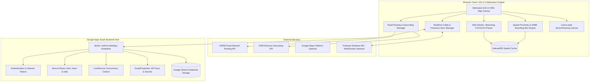

# DLPC_Map_Collaborative System Architecture Specification

## 1. System Overview
The Collaborative Interactive Map Web Application for Davao Light and Power Company (DLPC) provides utility planners, engineers, and authorized contractors with a real-time collaborative GIS mapping platform.

The system combines Google Apps Script (GAS) enterprise host environment with high-performance client-side GIS rendering, road-aligned routing, spatial proximity calculations for Network Access Points (NAPs), and Canva-style collaborative map authoring.

## 2. Component Architecture Breakdown

### 2.1 Frontend Architecture
- **Framework & Runtime:** HTML5, Modern ES6+ Modular Vanilla JavaScript, and Clean Scoped CSS Tokens following Emil Kowalski craft guidelines and the Taste Skill standards.
- **Design Philosophy:** Minimalist GIS tool. Map dominates 85-90% of screen. Single accent color, zero purple AI slop, hardware-accelerated transforms (`transform`, `opacity`), fluid 200ms ease-out transitions (`cubic-bezier(0.23, 1, 0.32, 1)`).
- **Map Engine:** Leaflet.js / MapLibre GL with customizable high-resolution tile layers (OpenStreetMap, CartoDB Positron, Google Road/Satellite).
- **Canva-Style Drawing System:** Vector map canvas overlay with Freehand polyline, Arrow, Line, Rectangle, Circle, Polygon, Text marker, Pin, and Selection/Transform handles with full undo/redo.

### 2.2 Backend Architecture (Google Apps Script)
- **Host Platform:** Google Apps Script Web App (`doGet(e)` / `doPost(e)`).
- **Router & Controller:** RESTful command dispatcher handling:
  - `auth_login`, `auth_verify_session`
  - `map_create`, `map_get`, `map_list`, `map_update`, `map_delete`
  - `share_generate_link`, `share_verify_token`, `share_revoke_link`
  - `route_create`, `route_update`, `route_delete`, `route_list`
  - `nap_import_batch`, `nap_list_viewport`, `nap_update`
  - `draw_save_object`, `draw_delete_object`, `draw_list`
  - `tag_manage`
  - `audit_log`
- **Data Persistence:** Google Sheets database structured with relational tabs:
  - `Users`
  - `Maps`
  - `MapAccess` (secure tokens)
  - `Routes`
  - `NAPs` (Davao South & Davao North filtered)
  - `Drawings`
  - `Tags`
  - `AuditLogs`
- **Concurrency & Locking:** `LockService.getScriptLock()` prevents race conditions during simultaneous sheet writes.

### 2.3 Real-Time Collaboration & Presence Architecture
- **Primary Transport:** Firebase Realtime Database (RTDB) client WebSocket channel.
  - Ephemeral presence path: `/maps/{mapId}/presence/{sessionId}` (cursor lat/lng, user name, color, active object, timestamp). Auto-removed via `onDisconnect().remove()`.
  - Live object state path: `/maps/{mapId}/objects/{objectId}` (version, delta, payload, updatedBy).
- **Hybrid Fallback Engine:** Pure Google Apps Script polling mode with 3s adaptive intervals and ETags/version vector comparison when external RTDB is unconfigured, ensuring 100% standalone reliability.

### 2.4 Streaming NAP Import Architecture (345MB CSV & XLSX)
- **Problem:** GAS max upload is 50MB and execution timeout is 6 minutes.
- **Solution:** Browser-based chunked streaming via Web Worker (PapaParse / SheetJS).
- **Filtering Pipeline:**
  1. Chunk read (2MB chunks)
  2. Parse row
  3. Validate mandatory fields
  4. Davao filter: Retains row if City/Location/State contains "Davao", "DVO", or coordinates fall within `[6.7, 7.6] lat`, `[125.2, 126.3] lng`. Drops all other provinces (~96% of data).
  5. Stores valid records in local IndexedDB.
  6. Batch syncs curated records to GAS in batches of 500 records.

### 2.5 Road-Aligned Routing & Geocoding
- Pluggable provider interface:
  - Default: OSRM (Open Source Routing Machine) road network route geometry (`overview=full&geometries=geojson`) + OSM Nominatim reverse geocoder.
  - Optional: Google Maps Directions & Geocoding via secure server-side proxy.
- Coordinates validated: Lat `[-90, 90]`, Lng `[-180, 180]`.
- Generates road-following polylines with distance, driving geometry, start/end addresses, and preserves both `generatedAddress` and `correctedAddress`.
