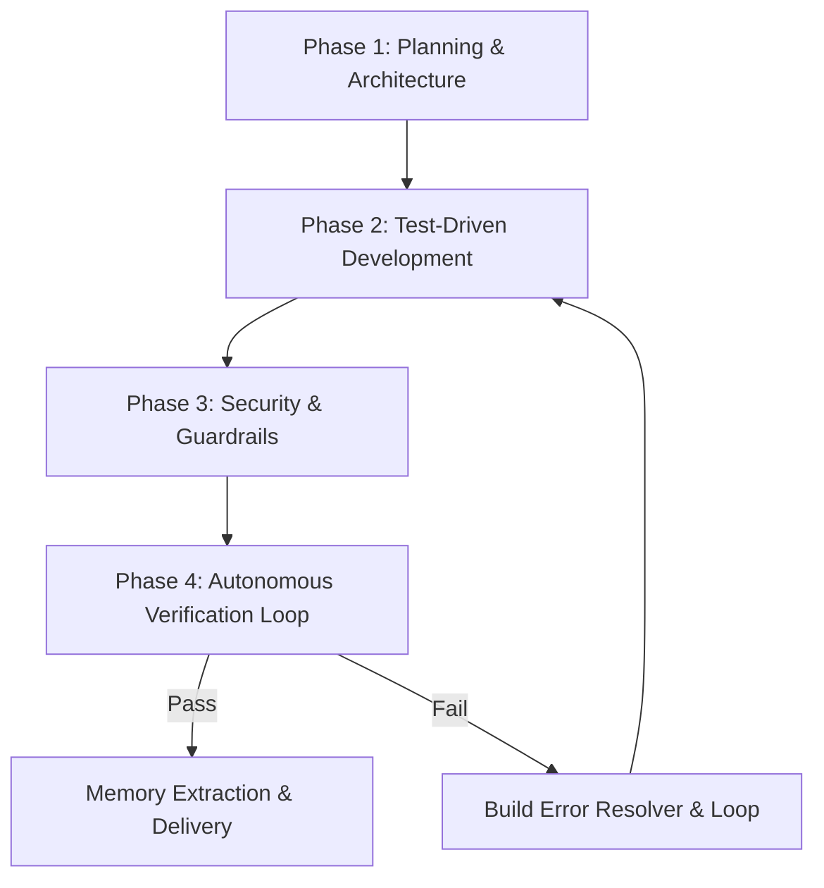

# ECC (Everything Claude Code) Agent Harness System

The **ECC (Everything Claude Code)** harness is an agent performance optimization system created by Affaan Mustafa ([affaan-m/ECC](https://github.com/affaan-m/ECC)). In **DLPC_Map_Collaborative**, ECC is installed under the native Antigravity 2.0 layout (`.agents/`), providing structured engineering personas, quality workflows, modular rules, and autonomous verification loops.

---

## 1. Native Antigravity 2.0 Architecture

Antigravity 2.0 discovers customizations from the project-local `.agents/` root. ECC's installation cleanly maps into this structure:

```text
.agents/
├── agents/             # 68 specialized sub-agent persona definitions (.md)
│   ├── planner.md
│   ├── architect.md
│   ├── code-reviewer.md
│   ├── security-reviewer.md
│   ├── tdd-guide.md
│   ├── build-error-resolver.md
│   └── ...
├── skills/             # Reusable on-demand workflows (with SKILL.md)
│   ├── tdd-workflow/
│   ├── verification-loop/
│   ├── browser-qa/
│   ├── codebase-onboarding/
│   ├── architecture-decision-records/
│   └── ...
├── rules/              # 122 collision-safe workspace rules
│   ├── common-agents.md
│   ├── common-security.md
│   ├── common-testing.md
│   └── ...
├── workflows/          # 94 slash command workflows
│   ├── feature-dev.md
│   ├── code-review.md
│   ├── build-fix.md
│   └── ...
└── ecc-install-state.json # Install manifest and profile lock
```

---

## 2. The 4-Phase Agentic Execution Loop

When executing complex feature implementations, refactors, or bugfixes for DLPC_Map_Collaborative, the agent operates through this disciplined loop:



### Phase 1: Planning & Architecture (`planner` / `architect`)
- **Persona Reference**: `.agents/agents/planner.md`, `.agents/agents/architect.md`
- **Execution**:
  - Before altering code or schemas, inspect the affected files and modules.
  - Review existing architectural constraints in `Vault/DLPC_Map_Collaborative/02 - Architecture/` and `03 - Decisions/`.
  - Formulate an explicit plan detailing affected files, risk areas, backward compatibility, and edge cases.

### Phase 2: Test-Driven Development (`tdd-guide` & `tdd-workflow`)
- **Persona & Skill**: `.agents/agents/tdd-guide.md`, `.agents/skills/tdd-workflow/`
- **Execution**:
  - Write test specifications or reproduction scripts *before* writing core business logic.
  - Write the minimal necessary code to make the tests pass.
  - Keep domain logic, API endpoints, and UI layers loosely coupled.

### Phase 3: Security & Guardrails (`security-reviewer` & `security-review`)
- **Persona & Skill**: `.agents/agents/security-reviewer.md`, `.agents/rules/common-security.md`
- **Execution**:
  - Evaluate all code changes for security vulnerabilities:
    1. Input validation & sanitization (prevent SQL/NoSQL injection in spatial databases).
    2. Role-based access control (RBAC) and tenant isolation for DLPC utility data.
    3. Strict credential safety (never expose API keys, DB passwords, or tokens in git or memory).
    4. Safe state mutations and concurrency safeguards.

### Phase 4: Verification Loop & Self-Correction (`verification-loop` & `build-error-resolver`)
- **Persona & Skill**: `.agents/skills/verification-loop/`, `.agents/agents/build-error-resolver.md`
- **Execution**:
  - Run type checks, linters, unit tests, and build commands.
  - If any check fails, adopt the `build-error-resolver` persona: isolate root cause, patch with minimal blast radius, and re-verify.
  - Never declare a task complete until all verifications pass cleanly.

---

## 3. Key Sub-Agent Personas

| Agent | File Path | Focus Area |
| :--- | :--- | :--- |
| **`planner`** | `.agents/agents/planner.md` | Feature breakdown, dependency analysis, edge case identification. |
| **`architect`** | `.agents/agents/architect.md` | System design, data models, modular boundaries, ADR drafting. |
| **`code-reviewer`** | `.agents/agents/code-reviewer.md` | Code quality, maintainability, performance, adherence to guidelines. |
| **`security-reviewer`** | `.agents/agents/security-reviewer.md` | Vulnerability scanning, OWASP top 10, sanitization, auth boundaries. |
| **`tdd-guide`** | `.agents/agents/tdd-guide.md` | Test scaffolding, red-green-refactor cycle, regression prevention. |
| **`build-error-resolver`** | `.agents/agents/build-error-resolver.md` | TypeScript errors, compilation breaks, dependency mismatch fixes. |
| **`e2e-runner`** | `.agents/agents/e2e-runner.md` | End-to-end browser testing, user journey validation. |
| **`refactor-cleaner`** | `.agents/agents/refactor-cleaner.md` | Dead code pruning, cognitive complexity reduction, pattern simplification. |
| **`database-reviewer`** | `.agents/agents/database-reviewer.md` | Spatial query optimization, indexing, migration safety, schema normalization. |
| **`react-reviewer`** | `.agents/agents/react-reviewer.md` | React lifecycle, state rendering efficiency, hook dependencies. |

---

## 4. Multi-Framework Synergy in DLPC_Map_Collaborative

The project combines three world-class capability layers that operate together without overlap:

```text
┌────────────────────────────────────────────────────────┐
│                   ANTIGRAVITY AGENT                    │
└────────────────────────────────────────────────────────┘
                           │
       ┌───────────────────┼───────────────────┐
       ▼                   ▼                   ▼
┌──────────────┐    ┌──────────────┐    ┌──────────────┐
│   OBSIDIAN   │    │  TASTE SKILL │    │     ECC      │
│    MEMORY    │    │ & EMIL MOT.  │    │  DEVELOPER   │
│ (Cognition)  │    │  (Aesthetics)│    │ (Engineering)│
├──────────────┤    ├──────────────┤    ├──────────────┤
│ Persistent   │    │ Anti-Slop UI │    │ 68 Agents    │
│ Vault        │    │ 3 Dials      │    │ 4-Phase Loop │
│ Silent Extr. │    │ Emil Motion  │    │ TDD & Verify │
│ ADRs & State │    │ 60fps Craft  │    │ Security Gate│
└──────────────┘    └──────────────┘    └──────────────┘
```

1. **Obsidian Memory** (`obsidian-memory`): Governs the agent's long-term cognitive brain, project memory graph, user preferences, and architectural history.
2. **Taste & Emil Kowalski System** (`taste-skill`, `emil-design-eng`): Governs UI/UX aesthetics, layout variance, typography, and motion discipline.
3. **ECC Developer Suite** (`ecc-universal`): Governs engineering discipline, test-driven development, security audit gates, build repair, and role-specialized subagents.

---

## Related Notes
- [[CORE_MEMORY]]
- [[CURRENT_STATE]]
- [[Agent_Skills_Catalog]]
- [[ADR-003 - Adoption of ECC Everything Claude Code System]]
- [[ADR-002 - Adoption of Taste Skill and Emil Kowalski Design Engineering Systems]]
